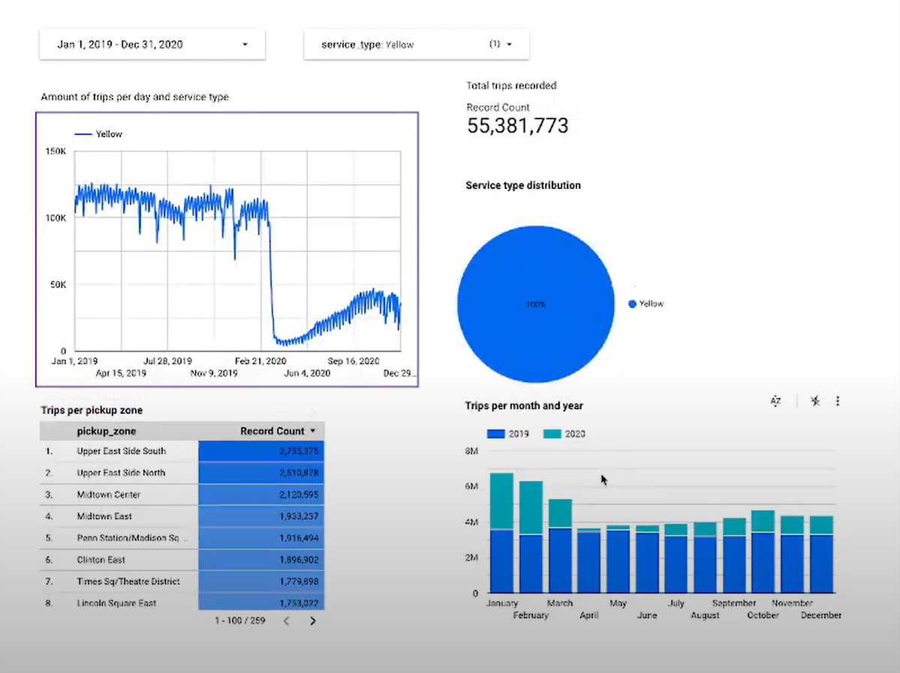

# 55 Million Rides in NYC: A Supervised ML Dive into Tipping Patterns

## Project Overview

This project uses supervised machine learning to find tipping patterns in NYC taxi markets. By analyzing a vast dataset from the New York City Taxi and Limousine Commission (TLC), I developed a model that predicts fare and tip amounts, providing key insights that could impact the taxi industry's approach to pricing and customer service. 

<p align="center">
  
</p>

### Data Source
The comprehensive dataset is available through the [NYC TLC Trip Record Data](https://www.nyc.gov/site/tlc/about/tlc-trip-record-data.page), ensuring a solid foundation for our analytics.

### Key Data Fields
We processed critical fields that capture the essence of each trip, such as pick-up and drop-off times and locations, trip distances, fares, and more.

| Field Name             | Description                                      |
|------------------------|--------------------------------------------------|
| `Pickup_DateTime`      | Start time of the trip.                          |
| `Dropoff_DateTime`     | End time of the trip.                            |
| `Pickup_Location`      | Initial location of the passenger(s).            |
| `Dropoff_Location`     | Final destination of the passenger(s).           |
| `Trip_Distance`        | Distance covered during the trip.                |
| `Fare_Amount`          | Cost of the trip excluding additional charges.   |
| `Rate_Type`            | Tariff rate type applied to the trip.            |
| `Payment_Type`         | Method of payment utilized.                      |
| `Passenger_Count`      | Number of passengers as reported by the driver. |

### FHV Data
FHV data adds another layer, giving us a glimpse into the dispatching side of the industry and further enriching our analysis.

| Field Name               | Description                                 |
|--------------------------|---------------------------------------------|
| `Base_License_Number`    | Dispatching base's license number.          |
| `Pickup_DateTime`        | Time when the FHV ride started.             |
| `Pickup_Location_ID`     | Taxi zone ID where the ride commenced.      |


## Data Pipeline Architecture
The backbone of this analysis was a data pipeline designed to handle and process over 55 million taxi trip records. It combined Python scripting, the structured workflow orchestration of Apache Airflow, and the processing power of Apache Spark, all culminating in the comprehensive analytical capabilities of Google BigQuery.

<p align="center">
  
</p>

## Data Visualization in Looker

<p align="center">
  
</p>

The Looker dashboard above serves as a window into the extensive analysis conducted on NYC's yellow taxi usage over two years. It showcases daily traffic volumes, zone popularity, and service type distributions. 

### Insights and Business Impact

- **Daily Traffic Volumes**: Identifying peak times for optimized driver schedules and fleet deployment.
- **Total Trip Insights**: Over 55 million trips analyzed for a comprehensive view of the industry's magnitude.
- **Service Focus**: Concentrated analysis on yellow taxi services to deliver targeted enhancements.
- **Zone Hotspots**: Recognition of high-demand zones to improve taxi availability and reduce wait times.
- **Yearly Trends**: Monthly comparisons between 2019 and 2020, informing about the impacts of external events on service demands.

## Technology Stack

- **Linux**: The operating system of choice for managing data-intensive applications.
- **PostgreSQL**: A robust system for database management.
- **Docker**: Used for application containerization, ensuring consistency across environments.
- **Google Cloud Platform**: Utilized for its suite of services including BigQuery, Cloud Storage, and Cloud SQL.
- **Terraform**: For provisioning and managing cloud services as code.
- **Airflow**: For orchestrating and automating ETL pipelines.
- **DBT Cloud**: For transforming data in the cloud-based warehouse.
- **Apache Spark and Kafka**: For real-time data processing and streaming.

## Tip Prediction with Machine Learning

Below is a SQL code snippet highlighting the machine learning model development, showcasing the approach taken to predict tipping behaviors, which has a significant impact on dynamic pricing and customer service strategies.

```sql
-- Hyperparameter tuning to refine the prediction model
CREATE OR REPLACE MODEL trips_data_all.tip_hyperparam_model
OPTIONS
  (model_type='linear_reg',
  input_label_cols=['tip_amount'],
  DATA_SPLIT METHOD='AUTO_SPLIT',
  num_trials=5,
  max_parallel_trials=2,
  l1_reg=hparam_range(0, 20),
  l2_reg=hparam_candidates([0, 0.1, 1, 10])) AS
SELECT * FROM trips_data_all.yellow_tripdata_ml WHERE tip_amount IS NOT NULL;