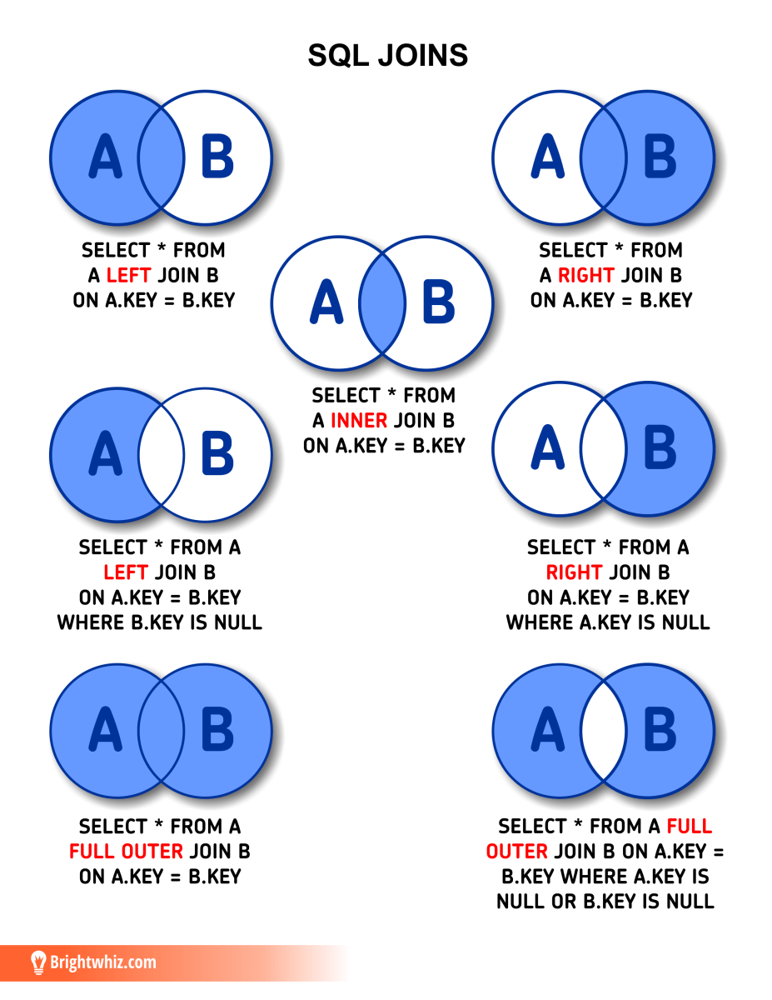

# Notes from week 1

## Learnings, code, problems encountered, solutions
- Docker, Jupyter, command line, mingw, gitbash, environment variables, http server from python,  
- Longest part was installing and learning command line 
- The task is to ingest data into PostgreSQL and explore the dataset

# Data pipeline

## Data pipeline

`A data pipeline is a set of processes that move data from one place to another. This typically involves extracting data from a source, transforming the data to fit the desired format or structure, and loading the data into a destination such as a database or data warehouse. Data pipelines are commonly used to transfer data between different systems or applications, or to move data from operational systems into a data lake or data warehouse for further analysis. Data pipelines can be built using a variety of tools and technologies, and can be designed to operate in real-time, near-real-time, or batch mode, depending on the specific requirements of the data flow.`

## E - extracting

`Data extraction refers to the process of pulling data from one or more sources and making it available for further processing or analysis. This typically involves connecting to the source system, querying the data using a specific set of criteria, and extracting the data in a format that can be easily transported and transformed. The extracted data is often stored in a temporary location such as a staging area or buffer, from which it can be further processed and loaded into the destination. Data extraction can be performed using a variety of tools and technologies, depending on the type of source system and the format of the data. For example, if the source system is a relational database, you might use SQL queries to extract the data. If the source system is a file-based system, you might use tools such as grep or sed to extract the data from text files. If the source system is a web-based API, you might use HTTP requests to retrieve the data in a format such as JSON or XML.`

## T - transforming

`In the context of a data pipeline, data transformation refers to the process of converting the data from its raw, extracted form into a format that is more suitable for the intended use of the data. This typically involves cleaning and normalizing the data, as well as applying various transformations and manipulations to make the data more consistent, accurate, and usable. Data transformation can involve a wide range of activities, depending on the specific needs and goals of the data pipeline. Some common data transformation tasks include:
`

* Removing or replacing missing or invalid data

* Standardizing and normalizing data values (e.g. converting all dates to a consistent format)

* Joining or merging data from multiple sources

* Aggregating or summarizing data (e.g. computing sums, averages, or counts)

* Applying specific rules or business logic to transform the data (e.g. calculating discounts or applying tax rates)

* Encoding or decoding data (e.g. applying a hash function to encrypt sensitive data)

`
It helps to ensure that the data is in a usable and consistent form before it is loaded into the destination. It also allows the data to be tailored to the specific needs and requirements of the downstream processes and applications that will be using the data.`

## L - loading

`In the context of a data pipeline, data loading refers to the process of transferring the transformed data from the pipeline into the final destination. This typically involves writing the data to a persistent storage system such as a database, data warehouse, or data lake, in a format that can be easily accessed and queried by downstream processes and applications. Data loading can be performed using a variety of tools and technologies, depending on the type of destination system and the format of the data. For example, if the destination system is a relational database, you might use SQL INSERT or UPDATE statements to load the data. If the destination system is a file-based system, you might use tools such as the Unix command line or the Python pandas library to write the data to text files or CSV files. If the destination system is a cloud-based storage system, you might use APIs or libraries provided by the cloud provider to load the data into the appropriate storage bucket or table. It ensures that the data is properly stored and accessible in the destination system, where it can be used by downstream processes and applications. It is also typically the final step in the data pipeline process, and marks the point at which the data is considered to be "loaded" and ready for use.`

## Data warehouse

`Data warehouses are different from operational databases, which are used to store and manage current data for day-to-day operations. Data warehouses are designed to store large amounts of data that is extracted from operational databases, as well as from other sources such as text files and external databases. The data is then cleaned, transformed, and integrated into a consistent format, and loaded into the data warehouse. This allows users to access and analyze the data in a consistent and efficient way, without impacting the performance of the operational systems.`

## Data lake

`A data lake is a type of repository or storage system that is designed to store and manage large volumes of raw, unstructured data. Data lakes are often used in conjunction with data pipelines and other tools to extract, transform, and load data from a variety of sources. The raw data is then stored in the data lake `

## Pros and Cons -- Data lake

### Pros of a data lake:

* Flexibility: Designed to store data in its raw, unstructured form, without applying any schema or transformation to the data

* Scalability: Built using distributed systems and cloud technologies, which allows them to store and process large volumes of data

* Cost-effectiveness: They leverage the scale and efficiency of cloud computing to store and process data at a lower cost and open-source technologies

### Cons of a data lake:

* Complexity: Can be complex to set up and manage, especially for users who are not familiar with distributed systems, cloud computing, and big data

* Quality: Data lakes are designed to store data in its raw, unstructured form, without applying any cleansing, transformation, or validation to the data

* Governance: Variety of users and applications can make it difficult to manage data governance policies, such as data security, privacy, and compliance

## Pros and Cons -- Data warehouse

### Pros of a data warehouse:

* Structure: Data warehouses are designed to store structured, cleansed data that is ready for analysis and reporting

* Performance: Optimized for complex, ad-hoc queries and can use advanced indexing and query optimization techniques to deliver fast and efficient results

* Governance: Data warehouses are typically designed to support data governance policies, such as data security, privacy, and compliance

### Cons of a data warehouse:

* Lack of Flexibility: Designed to store structured data, which means that the schema and structure of the data must be defined in advance

* Cost: Can be expensive to set up and maintain, especially if they use proprietary technologies and require specialized skills and expertise

* Scalability: Designed to store and process large volumes of structured data can make them less scalable and efficient than data lakes

## Summary of data lakes vs data warehouses

`Data lakes provide flexibility and scalability, but can be complex and difficult to ensure data quality, while data warehouses provide structure and performance, but can be inflexible and expensive.`

## Conjunction of data lake and data warehouse infrastructure

`Data is typically extracted from a variety of sources, and is then transformed and cleansed in a data lake before being loaded into a data warehouse. The data warehouse is then used to store and manage the structured data, and to support complex queries and analysis on the data.`

### Benefits:

* Flexibility: Data lake allows users to store and process data in its raw, unstructured form, without the need to pre-define the schema of the data

* Scalability: Data lake is typically built using distributed systems and cloud technologies, which allows it to store and process large volumes of data

* Governance: Data warehouse provides a centralized and structured repository for the data making it easier to manage data security, privacy, and compliance

# Docker

## Docker

`Docker is a tool designed to make it easier to create, deploy, and run applications by using containers. Containers allow a developer to package up an application with all of the parts it needs, such as libraries and other dependencies, and ship it all out as one package. By doing so, it ensures that the application will run reliably on any other machine, regardless of any customized settings that machine might have that could differ from the machine used for writing and testing the code.`

## Docker container

`A Docker container is a lightweight, standalone, and executable package of software that includes everything needed to run an application: the code, a runtime, libraries, environment variables, and config files. Containers are isolated from each other and bundle their own software, libraries, and configuration files, making them much more lightweight than virtual machines. This makes it possible to run many containers on a single host, with each container running its own application. Containers are an ideal way to package and distribute software, especially for microservices applications, because they are easy to create, manage, and deploy.`

## Docker image

`A Docker image is a lightweight, stand-alone, and executable package that includes everything needed to run a piece of software, including the code, a runtime, libraries, environment variables, and config files. Docker images are used to create Docker containers, which are isolated and portable environments that include all of the dependencies and settings needed to run a specific application.Docker images are built from Dockerfiles, which are text files that contain the instructions needed to build an image. A Dockerfile specifies the base image to use, any additional packages that need to be installed, the commands to run when the container is started, and other settings. Docker images are stored in Docker registries, such as the Docker Hub, which is a cloud-based registry service. Developers can create and share Docker images on the Docker Hub, and users can download and use these images to create Docker containers on their own machines. Docker images are an important part of the Docker platform because they provide a way to package and distribute software in a consistent and portable way. They allow developers to create reproducible and predictable environments that can be easily shared and deployed across different machines.`

## Dockerfile

`Dockerfile is a text file that contains instructions for building a Docker image. It specifies the base image to use, the commands to run to set up the environment and install dependencies, and other settings. Dockerfiles are used to automate the process of building Docker images, which are lightweight, standalone, and executable packages that include everything needed to run a piece of software. By using Dockerfiles, developers can define the components and dependencies of an image in a repeatable and predictable way, making it easy to create and share Docker images with others.`

## Docker Compose

`Docker Compose is a tool for defining and running multi-container Docker applications. With Docker Compose, developers can use a YAML file to define the services that make up an application, and then use a single command to create and start all of the services from the configuration. This makes it easy to manage complex applications that are made up of multiple containers.`

## YAML file

`YAML files are commonly used in applications that need to represent complex data structures in a simple and human-readable way. They are often used as configuration files for applications, because the simple syntax and indentation-based structure make them easy to read and edit. In the context of Docker, YAML files are used to define the services that make up a Docker Compose application`

## csv file

`A CSV (comma-separated values) file is a type of plain text file that stores tabular data in a simple, human-readable format. Each line of the file represents a single row of data, and the values within each line are separated by commas. This makes it easy to import and export data from spreadsheets and other programs that support CSV files. CSV files are often used for exchanging data between different applications and for importing and exporting data from databases. They are a simple and efficient way to represent and work with tabular data, and are supported by many different applications.`

## csv file and excel

`Yes, CSV is related to Excel in that CSV files can be opened and edited in Excel. CSV files are plain text files that store tabular data, and Excel is a popular program for working with tabular data.`

## JSON file

`A JSON (JavaScript Object Notation) file is a type of plain text file that is used to store data in a structured, human-readable format. JSON files use a standard syntax for representing data in key-value pairs, with keys and values separated by a colon, and each key-value pair separated by a comma. JSON files are commonly used for transmitting data between a server and a web application, and for storing data in a structured, easily-accessible format. They are a popular format for data exchange because they are easy to read and write, and can be parsed and generated by a wide variety of programming languages.`

## Docker even simpler

`To run a Docker container, you simply need to download the image for the application you want to run and use the docker run command to start the container. This creates an isolated environment on your machine that includes all of the dependencies and settings needed to run the application.`

# Jupyter notebook

## Jupyter 

`Jupyter Notebook is a web-based interactive computing platform that allows users to create and share documents that contain live code, equations, visualizations, and narrative text. It is commonly used for data cleaning and transformation, numerical simulation, statistical modeling, data visualization, and machine learning. Jupyter Notebook provides a powerful and flexible platform for interactive and exploratory computing. It combines the ability to execute code in a wide range of programming languages, with rich text and multimedia support, and the ability to collaborate with others in real-time. Jupyter Notebook is based on the Jupyter open-source project, which was created to develop open-standards for interactive computing across a wide range of programming languages. The Jupyter Notebook application is built on top of the Jupyter kernel architecture, which allows multiple programming languages to be used within the same notebook. Jupyter Notebook is widely used in the fields of data science, machine learning, and scientific computing. It is often used in conjunction with other popular tools, such as Pandas, NumPy, and Matplotlib, to perform data analysis and visualization. It is also commonly used in education and research to provide a platform for reproducible and collaborative computing.`

# PostgreSQL

## PostgreSQL

`PostgreSQL is a powerful, open-source, object-relational database management system (ORDBMS) that is widely used for managing large datasets. One of the main advantages of PostgreSQL over other relational database management systems is its ability to handle a wide variety of workloads. PostgreSQL is known for its flexibility, reliability, and performance, which make it a popular choice for many organizations. Additionally, PostgreSQL is highly extensible, allowing users to add new functions and data types easily. This makes it a good choice for applications that require custom data types or complex data processing capabilities.`

## Object-relational database

`An object-relational database (ORDBMS) is a type of database management system (DBMS) that combines the features of a relational database, which uses tables and rows to store data, with the features of an object-oriented database, which uses objects and classes to represent data. In an ORDBMS, data is stored in the form of objects, and those objects can be related to each other using the same kind of relationships that exist between objects in an object-oriented programming language. This allows for more flexibility and complexity in data modeling, making ORDBMSs well-suited for applications that require complex data structures or need to store data that doesn't fit neatly into a traditional relational database structure. Some examples of ORDBMSs include PostgreSQL, Oracle Database, and IBM DB2.`

## SQL Joins 

In SQL, a join is a way to combine data from two or more tables based on a common attribute. There are several different types of joins in SQL, each of which specifies a different way of combining the data. The most common types of joins are:

`INNER JOIN: Only rows that have a match in both tables`

`OUTER JOIN: All rows from one table with any matching rows from the other table including NULL values for any rows that don't have a match in the other table`

`LEFT JOIN: All rows from the left table with any matching rows from the right table, and includes NULL values for any rows from the right table`

`RIGHT JOIN: All rows from the right table with any matching rows from the left table, and includes NULL values for any rows from the left table`

Joins are used in SQL to combine data from multiple tables and allow for more complex and powerful queries. For example, you might use a join to combine data from a customers table and an orders table to find out which customers have placed orders, or to combine data from a products table and an inventory table to find out which products are currently in stock.

# Terraform

## Terraform

`Terraform is a tool for building, changing, and versioning infrastructure safely and efficiently. It is an open-source tool that allows users to define and provision a datacenter infrastructure using a high-level configuration language, known as HashiCorp Configuration Language (HCL). This infrastructure can be represented as "infrastructure as code," allowing it to be managed and versioned like any other codebase. Terraform is typically used to manage infrastructure on cloud platforms such as AWS, Azure, and Google Cloud, but it can also be used to manage on-premises environments and other types of infrastructure.`

## Infrastructure as code

`Infrastructure as code (IAC) is a way of managing and provisioning infrastructure using code and automation tools, rather than manually configuring resources through a web-based interface or a set of command-line tools. With IAC, the infrastructure is defined and managed using code, which allows it to be treated like any other codebase and managed using the same version control and collaboration tools. This makes it easier to manage and maintain the infrastructure over time, and also allows for more efficient and repeatable provisioning of resources.`

## Terraform's alternatives

`Some popular alternatives to Terraform include CloudFormation from AWS, Azure Resource Manager from Microsoft, and GCP Deployment Manager from Google. These tools are similar to Terraform in that they allow users to define and provision their infrastructure using code, but they are specific to the respective cloud platforms and may have some unique features and capabilities. Other tools that provide similar functionality to Terraform include Ansible, Puppet, and Chef. These tools are often used for configuration management and can be used in conjunction with Terraform to manage infrastructure.`

#### Create Dockerfile and pipeline.py

****  Postgres configuration

services:
  postgres:
    image: postgres:13
    environment:
      POSTGRES_USER: airflow
      POSTGRES_PASSWORD: airflow
      POSTGRES_DB: airflow
    volumes:
      - postgres-db-volume:/var/lib/postgresql/data
    healthcheck:
      test: ["CMD", "pg_isready", "-U", "airflow"]
      interval: 5s
      retries: 5
    restart: always

**** Postgres configuration

## I have a .csv dataset, now what?

- Use Docker as it allows me to use software tools outside of my local machine (tests, experiments, no harm to my machine)
- Load the .csv file into PostreSQL which runs in docker image using jupyter notebook (or any other way) 

### Docker basic commands

- winpty docker run hello-world
- docker ps --> show running containers
- docker ps -a --> show all containers
- docker stop "container ID"
- docker start "container ID" 
- docker-compose

## Code needed for the first configuration and run outside of docker-compose.yaml file

1. Run PostgreSQL in Docker
        winpty docker run -it \
          -e POSTGRES_USER="root" \
          -e POSTGRES_PASSWORD="root" \
          -e POSTGRES_DB="ny_taxi" \
          -v c://users//adamb//tech//data-engineering-zoomcamp//week-1-basics-n-setup//2-docker-sql//ny_taxi_postgres_data:/var/lib/postgresql/data \
          -p 5432:5432 \
        postgres:13

2. Connect to pgcli which is terminal-like interface for PostgreSQL
        winpty pgcli -h localhost -p 5432 -u root -d ny_taxi     

3. Insert csv data into into PostgreSQL using jupyter 

4. Use pgcli as a command line interface for PostgreSQL or switch to their GUI
   
5. Connect to pgadmin for a web-based PostgreSQL GUI

      winpty docker run -it \
        -e PGADMIN_DEFAULT_EMAIL="admin@admin.com" \
        -e PGADMIN_DEFAULT_PASSWORD="root" \
        -p 8080:80 \
        dpage/pgadmin4
  
6. In a browser search localhost:8080

7. docker network create "pg-network"
   
8. Then
   
      winpty docker run -it \
        -e POSTGRES_USER="root" \
        -e POSTGRES_PASSWORD="root" \
        -e POSTGRES_DB="ny_taxi"\\-v c://Users//adamb//tech//data-engineering-zoomcamp//week-1-basics-n-setup//2-docker-sql//ny_taxi_postgres_data:/var/lib/postgresql/data \
          -p 5432:5432 \
        --network=pg-network \
        --name pg-database \
      postgres:13

9.  Run pgAdmin
    
        winpty docker run -it \
            -e PGADMIN_DEFAULT_EMAIL="admin@admin.com" \
            -e PGADMIN_DEFAULT_PASSWORD="root" \
            -p 8080:80 \
            --network=pg-network \
            --name pgadmin \
        dpage/pgadmin4

#### Run the ingest_data file

python ingest_data.py \
    --user=root \
    --password=root \ 
    --host=localhost \
    --port=5432 \ 
    --db=ny_taxi \
    --table_name=yellow_taxi_trips \
    --url=https://github.com/DataTalksClub/nyc-tlc-data/releases/download/yellow/yellow_tripdata_2021-01.csv.gz \

#### Dockerize ingest_data file

winpty docker build -t taxi_ingest:v001 .

winpty docker run -it \
    --network=pg-network \
    taxi_ingest:v001 \
      --user=root \
      --password root \
      --host pg-database \
      --port 5432 \
      --db ny_taxi \
      --table_name yellow_taxi_trips \
      --url http://10.178.30.142:8000/yellow_tripdata_2021-01.csv \

### Add taxi_zones_lookup data into PostgreSQL

## PostgreSQl refresher 

#### Sample analytical queries

#### Know JOINS and GROUP BY as those are used the most in data analysis

#### Query 1

SELECT 
	tpep_pickup_datetime,
	tpep_dropoff_datetime,
	total_amount,
	CONCAT(zpu."Borough", ' / ', zpu."Zone") AS "pickup_loc",
	CONCAT(zdo."Borough", ' / ', zdo."Zone") AS "dropoff_loc"
FROM
	yellow_taxi_trips t JOIN zones zpu 
		ON t."PULocationID" = zpu."LocationID" 
	JOIN zones zdo 
		ON t."DOLocationID" = zdo."LocationID"
LIMIT 100;

#### Query 2

SELECT 
	tpep_pickup_datetime,
	tpep_dropoff_datetime,
	total_amount,
	CONCAT(zpu."Borough", ' / ', zpu."Zone") AS "pickup_loc",
	CONCAT(zdo."Borough", ' / ', zdo."Zone") AS "dropoff_loc"
FROM
	yellow_taxi_trips t LEFT JOIN zones zpu 
		ON t."PULocationID" = zpu."LocationID" 
	LEFT JOIN zones zdo 
		ON t."DOLocationID" = zdo."LocationID"
LIMIT 100;

#### Query 3

SELECT 
	CAST(tpep_dropoff_datetime AS DATE) as "day",
	"DOLocationID",
	COUNT(1) as "Count",
	MAX(total_amount) as "Amount",
	MAX(passenger_count) as "PassengerCount"
FROM
	yellow_taxi_trips t
GROUP BY
	1, 2
ORDER BY 
	"day" ASC,
	"DOLocationID" ASC;

### docker-compose
- Run just one program and that starts the two containers
- pgdatabase and pgadmin images
- have it saved in vs code and run --> docker-compose up -d
- localhost:8080 in a browser

## Terraform and GCP

- O-Auth
- Authenticate your local setup with the GCP

